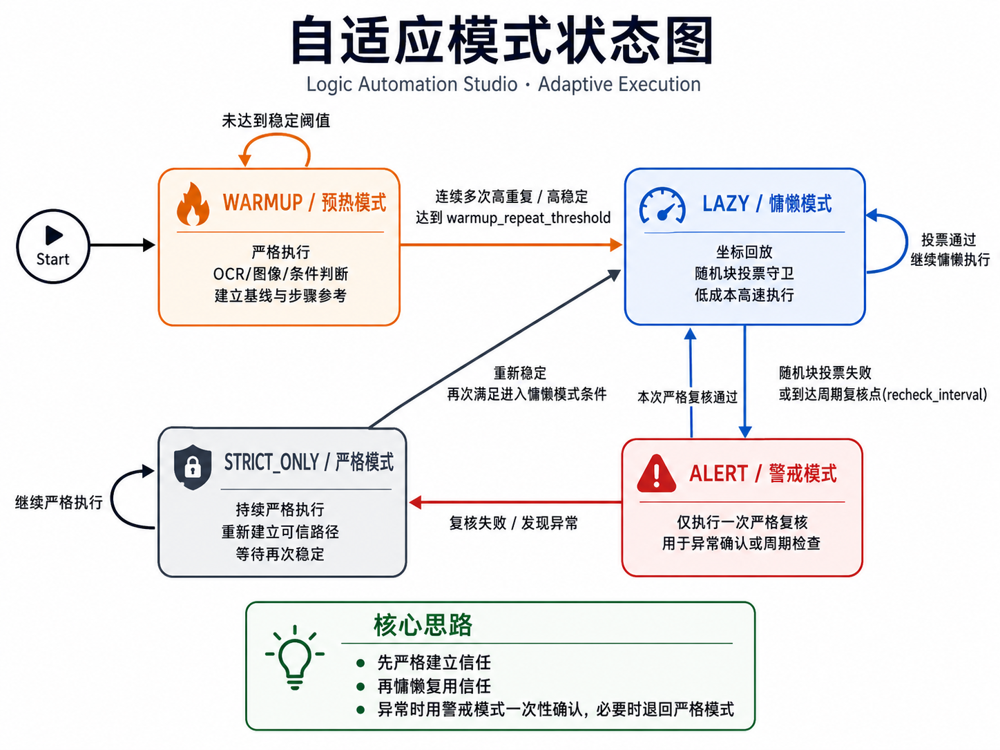

# Logic Automation Studio

一个面向桌面自动化的可视化流程引擎，支持 OCR 文字点击、图像匹配、坐标操作、条件分支，以及基于随机块投票的自适应执行模式。

---

## 1. 项目定位

本项目不是简单的“录制回放器”，而是一个小型流程引擎：

- 通过 GUI 编排步骤（点击、输入、等待、条件判断）
- 以 `start -> step -> branch` 的方式执行
- 每步支持重试、失败跳转、日志
- 支持流程图可视化检查脚本逻辑

适合场景：

- 界面按钮位置会变化，但文本/图像特征稳定
- 需要“成功继续、失败分支”的自动化流程
- 需要复用流程并迁移到不同机器

---

## 2. 主要能力

### 动作类步骤

- `ClickText`：OCR 找文字并点击
- `ClickPosition`：按屏幕坐标点击
- `ClickImage`：模板匹配找图点击（支持置信度）
- `TypeText`：向当前焦点输入整段文字（支持中文）
- `KeyPress`：模拟按键
- `Wait`：等待

### 条件类步骤

- `IfElse` + `ExistsText`
- `IfElse` + `ExistsImage`

### 控制能力

- `retry_count` + `retry_interval_sec`
- `on_error` 失败跳转
- `next` 顺序跳转
- 循环失败重试（整轮级，可配置重试次数与间隔）
- 实时运行日志
- 运行日志折叠（减少前台界面变化对守卫比对的干扰）
- 只读流程图（查看 `next / true / false / on_error`）

---

## 3. 模块结构与实现逻辑

```text
automation_studio.py      # 可视化编辑器（主入口）
automation_runtime.py     # 流程执行引擎

click_actions/
  text_click.py           # 基于 OCR 的文字点击
  position_click.py       # 坐标点击
  image_click.py          # 模板匹配图片点击
  text_type.py            # SendInput 文本输入

ocr/
  youdao_locator.py       # OCR 入口封装（转发到 youdao_text_locator）

youdao_text_locator.py    # 有道 OCR 请求、结果解析、坐标映射（含 DPI）
```

### 3.1 `automation_studio.py`（编辑器层）

负责：

- 步骤列表管理（新增、删除、排序）
- 步骤属性编辑（类型、跳转、重试）
- 参数编辑（输入框 + JSON 同步）
- 流程导入导出
- 运行流程与显示日志
- 绘制流程图（只读）

实现要点：

- 运行前自动保存当前步骤，保证执行的是最新配置
- 运行时自动隐藏窗口，避免识别到编辑器自身内容
- 支持按步骤类型自动搭建参数骨架

### 3.2 `automation_runtime.py`（执行引擎层）

负责：

- 按 `start` 进入流程，逐步执行
- 识别动作步骤与 `IfElse` 条件步骤
- 处理重试、失败跳转、结束状态
- 输出结构化日志

执行流程简述：

1. 找到当前步骤
2. 若是 `IfElse`，执行 condition，跳 `on_true` / `on_false`
3. 若是动作步骤，执行动作并根据成功/失败走 `next` 或 `on_error`
4. 遇到 `STOP` 或错误结束

### 3.3 自适应执行模式

当前版本采用自动判模状态机：

- `WARMUP`：严格执行并建立基线参考，验证高重复度。
- `LAZY`：复用步骤参考并执行低耗守卫抽检。
- `ALERT`：守卫异常或周期复核触发后执行一次严格复核。
- `STRICT_ONLY`：警戒复核失败后的降级模式。

判定与切换规则：

- 勾选“启用自适应模式”后，进入自动判模流程，不依赖手工 strict/lazy。
- 参考块固定为每个步骤首次严格成功时的基线，不做每轮覆盖。
- 守卫每轮随机挑选 1 个步骤，并随机抽样多个块投票判定。
- 预热阶段通过“重复度阈值 + 坐标容差 + 连续达标轮数”判定是否可进入 `LAZY`。
- 所有动作步骤都纳入守卫与参考（`ClickText` / `ClickImage` / `ClickPosition` / `TypeText` / `KeyPress` / `Wait`）。

状态图：



### 3.4 守卫落盘审计

为便于追溯，每次运行会在 `save/guard_debug/<会话时间戳>/` 下保存审计数据：

```text
save/guard_debug/<会话时间戳>/
  reference/
    <step_id>/capture_0001/...
  checks/
    check_000001/<step_id>/...
```

- `reference/`：步骤基线参考块（首次严格成功时保存）。
- `checks/`：每次守卫抽检保存实时块与报告。
- `checks` 中不重复保存参考块，通过 `report` 里的 `reference_path` 进行索引关联。
- 每次抽检会生成 `report.json` 与 `report.txt`，记录抽样索引、块相似度、逐块投票和总判定。

### 3.5 点击动作模块（`click_actions/`）

- `text_click.py`  
  调用 OCR 层定位文字坐标，支持单击/双击、精确匹配/包含匹配。

- `position_click.py`  
  直接调用 Windows 鼠标事件，适合固定点位。

- `image_click.py`  
  使用 OpenCV `matchTemplate` 做模板匹配：
  - 支持 `confidence` 阈值
  - `region` 可选；留空时自动使用虚拟全屏（自适应分辨率）
  - 中文路径读取用 `np.fromfile + cv2.imdecode`，避免 `imread` 路径问题

- `text_type.py`  
  用 `SendInput + KEYEVENTF_UNICODE` 输入文本，支持中文内容、按字符间隔、可选末尾回车。

### 3.6 OCR 模块（`youdao_text_locator.py`）

负责：

- 从 `set_ocr.txt` 读取 key/secret
- 生成有道签名并调用 OCR API
- 递归解析文字与边框
- 将截图坐标映射到屏幕坐标
- 处理 DPI 感知，避免坐标偏移

---

## 4. 配置文件（私密）

项目使用 `set_ocr.txt` 保存敏感信息（API key/secret），该文件已在 `.gitignore` 忽略，不会被提交。

### 使用方式

1. 复制模板：

```bash
copy set_ocr.example.txt set_ocr.txt
```

2. 在 `set_ocr.txt` 中填写：

- `youdao_appkey`
- `youdao_appsecret`
- `youdao_ocr_lang`（建议 `auto`）

---

## 5. `set_ocr.example.txt` 最小必要字段

```txt
youdao_appkey:
youdao_appsecret:
youdao_ocr_lang:auto
```

---

## 6. 步骤参数示例

### `ClickText`

```json
{
  "text": "发送",
  "exact_match": true,
  "case_sensitive": false,
  "delay_sec": 0,
  "click_times": 1
}
```

### `ClickPosition`

```json
{
  "x": 1200,
  "y": 800,
  "delay_sec": 0,
  "click_times": 1
}
```

### `ClickImage`

```json
{
  "template_path": "test/发送.png",
  "confidence": 0.82,
  "delay_sec": 0,
  "click_times": 1
}
```

> `region` 留空表示全屏自适应，不用按每台电脑重填分辨率。

### `TypeText`

```json
{
  "content": "你好，这是一段自动输入的文字",
  "delay_sec": 0.1,
  "interval_sec": 0.0,
  "press_enter": false
}
```

---

## 7. 运行方式

双击 `start.bat` 启动编辑器。

---

## 8. 运行建议

- 前台运行时可折叠“运行日志”，降低界面变化对截图比对的影响。
- 使用“循环失败重试”处理偶发识别抖动，避免单次失败直接停止。
- 自适应参数建议先用默认值，确认稳定后再微调。

### 工程默认参数（非理论最优）

以下是当前工程中的默认参数，用于“开箱可用”的平衡配置，**不是理论最优值**：

- 切块：`10x10`
- 每次抽样块数：`9`
- 相似度阈值：`0.88`
- 周期复核间隔：`50` 轮
- warmup 重复阈值：`0.90`

---

## 9. 依赖

- Python 3.10+
- requests
- pillow
- opencv-python
- numpy

